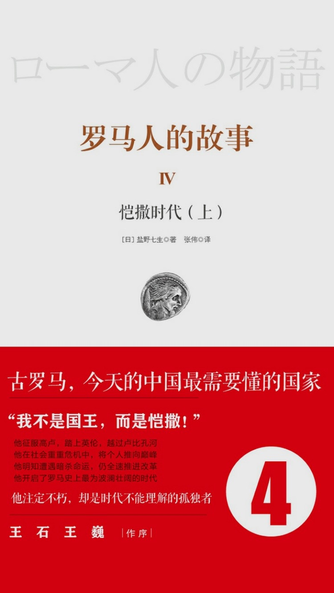

books2016
#########

:date: 2016-06-17 10:25:04

.. contents:: Table of Contents

.. sectnum::

最近在读 ``罗马人的故事`` 一本非常赞的书, 感慨之余, 分享一下最近的一些读书心得 :)

心外传奇
--------

这本书一开始蓝婴的例子, 原来刚生下来的孩子, 会因为心脏不尚未发育, 不能摄取足够的氧气, 导致全身发蓝或者发紫, 大多数小孩都会发蓝, 但是有的非常严重, 甚至因为缺氧导致影响智力, 仔细想来, 每次在会议室开会, 总会有缺氧的感觉, 跑步最先遇到的瓶颈也是呼吸, 而不是肌肉, 可能自己心脏比较弱, 导致争夺氧气的能力不够.

接下来对自己触动比较大的是心脏外科手术医生, 觉得他们就像是在人的身上做艺术, 努力做到最好, 同时又像是问题求解, 一个问题可以有多重解法, 每个医生都会给出自己认为最佳的解法, 每个手术, 他们不知道自己会不会成功, 只能尽最大的努力去做, 甚至有时候打开胸腔, 发现心脏结构完全和之前做CT检查的结果不一样.

相对于程序员, 我觉得他们做的事情更加有挑战, 因为他们的任何一个错误, 任何一个不负责任, 都是用生命做代价.

战争与和平
----------

这是一本挺大的书, 相传是人类有史以来最伟大的书籍之一, 场面非常宏大, 写的是法国俄国战争期间一群青年贵族的爱恨情愁, 读完了对于贵族的生活多了一些思考.

贵族就意味着从来不用为吃穿担心, 从生下来开始, 他们担忧的就是这个国家应该怎么发展, 遇到了战争, 应该怎样去为国家, 为名利去战斗,
作为一个中国人, 这些事很难想象的, 后来读凯撒才体会到,  西方的贵族确实是一群不一样的人, 而贵族身上的这种气质, 是很难在成人以后培养的.

百年孤独
--------

``百年孤独`` 是一本非常奇怪的书, 读起来甚至会觉得有点恶心, 但是读完之后他给我留下的记忆远远超过任何一本书, 永远会记得:
'多年以后, 当xxx上校面对着行刑队' 以及书尾四年零十个月的雨.

生如夏花
--------

``生如夏花`` 泰戈尔写的一本诗集, 第一次读诗, 给我的感觉很不一样, 非常美，如果你为人父母, 也许可以读一读:)

莎士比亚的戏剧
--------------

莎士比亚的戏剧, ``理查二世`` , ``亨利四世`` , 了解英国历史非常好的一段材料, ``威尼斯商人`` 讲的故事, 您也一定听过. 但是您不知道它来自于莎士比亚.

看完这些喜剧, 突然发现不少电影, 从星爷的 ``唐伯虎点秋香`` , 到最近的 ``夏洛特烦恼`` , 都是是非常戏剧化的作品, 形式上都是3-4幕, 通过非常夸张的台词, 对现实生活夸大的讽刺.

对冲基金风云录
--------------

``对冲基金风云录`` 是了解金融业的一个很有意思的读物, 可以了解到有的一些金融高富帅的生活,

交易员的业绩对个人能力要求很高, 然后更重要的是当前的经济形势, 在经济形势差的时候，任何好的交易员也做不出好的成绩, 而如果经济形势很好的时候, 就算很烂的交易员也可以做得不错

我还记得有个故事是说一个很成功的交易员, 他有三到四个帮手帮他在世界各地收集各种信息, 比如说啊某个国家某年的金矿开采量, 某个发展中国家的就业水平，他会用这些数据预测金融市场的走向，这有点机器学习的意思, 输入一些feature，输出一个预测值.

罗马人的故事
------------

``罗马人的故事`` 是一套超级大的书, 15部, 是目前为止我在多看上买的最贵的一套书, 现在读到第七部，给我印象最深刻的是从汉尼拔到凯撒的这个时期.

汉尼拔有点像中国的诸葛亮<时间也差不多, 公元0年左右>, 用兵如神, 在罗马鼎盛时期, 带着五万西班牙雇佣军, 翻阅比利牛斯山, 阿尔卑斯山, 在意大利本土盘踞了7年, 如入无人之境.

凯撒是一个战略上家, 同时很重视宣传, 他甚至亲自写了 ``高卢战记`` , ``内战记`` 这两本书, 来记录自己的功绩, ``罗马人的故事`` 非常好, 在很大程度上是因为凯撒留下的这两本书.

西方世界的四大战略家 亚历山大, 汉尼拔, 凯撒, 拿破仑, 他们都是源自于亚历山大的战术思想.

再有一个感触就是欧洲世界的两大母亲河, 多瑙河和莱茵河, 有点像中国的长江黄河, 罗马帝国时期基本就围绕着如何巩固两大防线展开的.

赠予今年的大学毕业生/ 胡适
--------------------------

这是来自一本<最朴素的生活和最遥远的梦想> 的散文集, 我在 '十点读书' 听到的，其实有很多大家, 我们只听过他们的名字却从来没有看过他们的作品, 当你第一次读他们的作品的时候，能感受到深深地震撼

胡适给大学毕业生开了三个方子, 追重要的是, 找一个有趣的问题:

'可是，如果你有了一个真有趣的问题天天逗你去想他，天天引诱你去解决他，天天对你挑衅笑，你无可奈何他——这时候，你就会同恋爱一个女子发了疯一样，没有书，你自会变卖家私去买书；没有仪器，你自会典押衣服去置办仪器'

非常赞的一段文字

